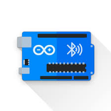

# Manuel d’Installation et d’Utilisation du Store Automatique

## Installation
Le code source est fourni dans un fichier `code/store.ino`. Il faut procéder comme suite pour lancer mettre le code source dans le microcontrolleur Arduino Uno :
- Connecter le microcontrolleur à votre ordinateur via le cable USB adapté.
- Ouvrir le fichier store.ino avec le logiciel Arduino.
- Cliquer sur le bouton "✓" pour verifier le code, si vous avec toutes les dépendances installées, la verification devrait bien se passer. Sinon le logiciel vous proposera de télécharger les dépendances manquantes.
- Cliquer sur le bouton "→" pour compiler et téléverser le code source dans le mico-controlleur.
- Ouvrir le moniteur série (Cliquer sur Terminal dans la barre de menu, puis sur Moniteur Série) pour avoir un feedback de ce qui se passe en temps réel (luminosité détectée, changement de mode, etc). 

Vous pouvez maintenant utiliser le Store Automatique.

## Utilisation
### Connection à la carte
Pour configurer le store, il faut d'abord se connecter en bluetooth.
Pour ca nous utilisons une application: **Arduino Bluetooth Controller**  

  

Pour se connecter, cliquez sur l'icone de prise et sélectionner le **module HC-05**. Le mot de passe par défaut du bluetooth est `1234`.

  

Vous êtes alors connecté à la carte.  
Il ne reste plus qu'a ouvrir le **terminal** pour entrer les commandes.  

  


Une fois connecté et devant le terminal, le store dispose de 2 modes.

### Mode manuel
Le mode manuel dispose de 2 commandes:
- Store en position haute: envoyer &nbsp; ```mu``` &nbsp; à la carte pour "manual up"
- Store en position basse: envoyer &nbsp; ```md``` &nbsp; à la carte pour "manual down"

### Mode automatique
Le mode automatique répond à la luminosité du capteur. Il est conseillé de l'attacher contre une fenètre.  
- Si le capteur y est exposé, le store va alors se fermer.
- Si le capteur retourne à l'ombre, le store va s'ouvrir.
Pour l'activer, il faut envoyer la commande &nbsp; ```a``` &nbsp; à la carte pour "automatic"