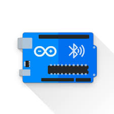

# Store Automatique

## Description du projet
Nous avons intitulé ce projet [STOMAT](https://github.com/Stevelening/StoresAutomatiques). Il s´agit d´un store Automatique, qui se ferme et s'ouvre en fonction de la luminosité ambiante. Il dispose aussi de commandes manuelles premettant à l´utilisateur de contrôler manuellement le store.

### L'équipe:
- Grathwohl Hugo
- Lening Talaupa Zidane Steve
- Saffo Tadaah Ange Leila
- Theubo Berger Ghislain

## Problématique
- Comment concevoir un store automatique, simple à utiliser et qui s'adapte à la luminosité ambiante ?  
- Comment donner la possibilité à l'utilisateur de contrôler le store de façon manuelle ?  
- Comment rendre les commandes du store personnalisables par l'utilisateur ?  

Dans ce cadre, nous avons décidé de construire un store automatique à petite échelle.

## Matériel
- une Arduino uno
- un capteur de lumière
- un module bluetooth HC-05
- un servomoteur continue SM-S4315R
- une breadboard qui était coupé en deux
- des fils de connections
- une structure en bois contreplaqué découpé au laser
- on a utilisé les chutes pour compléter cette structure
- 2 axes hélicoïdales en métal
- 2 tiges en métal
- élément de l'axe en PMMA découpé au laser
- un ressort
- une cartouche d'encre vide

## Utilisation
### Connection à la carte
Pour configurer le store, il faut d'abord se connecter en bluetooth.
Pour ca nous utilisons une application: **Arduino Bluetooth Controller**  

  

Pour se connecter, cliquez sur l'icone de prise et sélectionner le **module HC-05**. Le mot de passe par défaut du bluetooth est `1234`.

  

Vous êtes alors connecté à la carte.  
Il ne reste plus qu'a ouvrir le **terminal** pour entrer les commandes.  

  


Une fois connecté et devant le terminal, le store dispose de 2 modes.

### Mode manuel
Le mode manuel dispose de 2 commandes:
- Store en position haute: envoyer &nbsp; ```mu``` &nbsp; à la carte pour "manual up"
- Store en position basse: envoyer &nbsp; ```md``` &nbsp; à la carte pour "manual down"

### Mode automatique
Le mode automatique répond à la luminosité du capteur. Il est conseillé de l'attacher contre une fenètre.  
- Si le capteur y est exposé, le store va alors se fermer.
- Si le capteur retourne à l'ombre, le store va s'ouvrir.
Pour l'activer, il faut envoyer la commande &nbsp; ```a``` &nbsp; à la carte pour "automatic"  
  
Voici une [vidéo de présentation](https://www.youtube.com/shorts/BJVpmzUDGSg) du STOMAT:  

<iframe width="560" height="315" src="https://www.youtube.com/shorts/BJVpmzUDGSg" frameborder="0" allowfullscreen></iframe>


## Budget
### Cout matériel
| Composant              | Prix         |
|------------------------|--------------|
| Arduino uno            | 30 €         |
| Capteur de lumière     | 5 €          |
| Module bluetooth HC-05 | 10 €         |
| Servomoteur SM-S4315R  | 20 €         |
| Breadboard             | 5 €          |
| Reste                  | 15 € environ |
| Total                  | 85 €         |

### Temps de travail
En plus des **15h** de cours, nous avons fourni un investissement personnel d'environ **15h**.  
Cela fait environ **30h** de temps de travail par personne. Étant donné que nous étions 4 étudiants à travailler sur ce projet, ce projet aura nécessité au total environ **120h** heures de travail.

## Bilan
- bref bilan : vous avez répondu à la problématique, même en partie;
Dans l'ensemble nos objectifs par rapport a ce projet ont ete atteints initialement on avait pour objectif de faire des stores automatiques permettant en fonction d'une simple commande de pouvoir faire monter ou descendre les stores . Dans nos recherches on s'est rendu compte qu'onj pouvait le rendre aussi manuel en fonction de notre sensibilite au soleil ce qui rendait encore sa presence encore plus ineluctable dans notre vie au quotidien...

## Future
- future works étendu : au cours du projet
 
    On aurait peut etre pu ajouter la faculte a ce que ce dernier s'arrete lors de sa descente ou de sa montee  ou a quelle vitesse il doit aller dans un sens comme dans l'autre mais cet ensemble d'etapes et enfin modifier le seuil auquel le store s'arrete lors de son mouvement , ameliorer l'arbre moteur encore instable, une alimentation branchee sur secteur au lieu des cables connectes . En effet, tout cela constitue une version ulterieure de notre projet (avec des ressources et un temps plus consequent) .Un prototype en taill reele pouvant etre implemente au quotidien

    On aurait pu faire une application web et mobile permettant la connexion et la configuration du store automatique a distance.

Ceci peut bien evidemment etre commercialiser si cela est fait a une echelle reelle et avec toutes les fonctionnalites non implementees.

## Dépot
Le dépot git se trouve ici: [Lien du dépôt github du projet STOMAT](https://github.com/Stevelening/StoresAutomatiques)